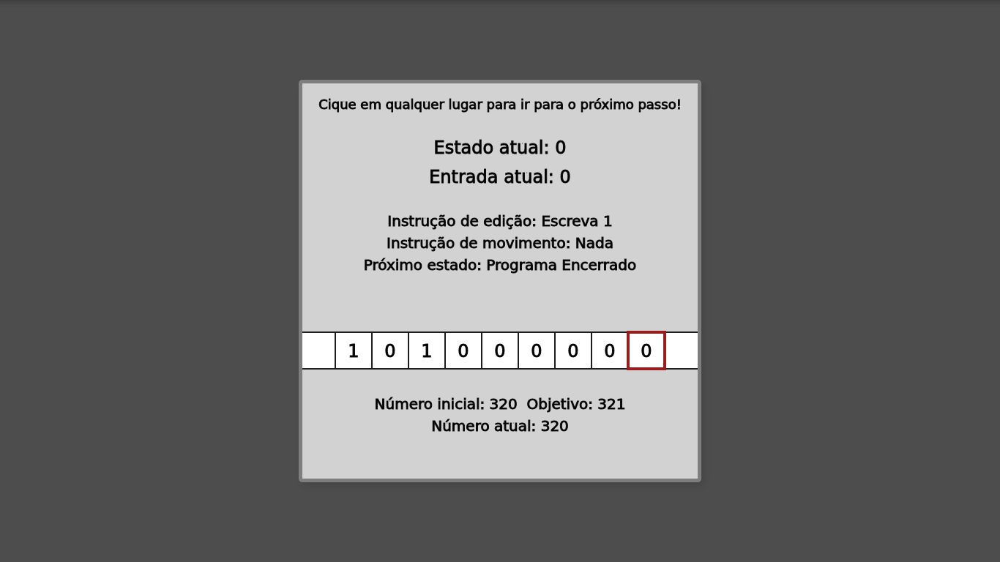

# Turing Machine

## An implementation of Turing's thought experiment

> Further reading can be found here: [Turing Machine - Wikipedia](https://en.wikipedia.org/wiki/Turing_machine)

---

### Algorithm

**A Turing Machine is a thought experiment idealized by Alan Turing, which consists of a _infinite movable strip_ divided into cells, each cell containing a 0 or a 1, and a _head_, which can read or write in one cell at the time, as well as able to store its current state.**

This project implements the concept of a **Turing Machine** to increment a binary number by one. The algorithm can be written as follows:

```md
1 Read the current cell
2 If the number is 0:
3 Write 1
4 Stop the program
5 If the number is 1:
6 Write 0
7 Move the strip to the right
8 Go back to line 1
9 Else:
10 Write 1
11 Stop the program
```

The algorithm can also be depicted using states; each state determines which operation will be performed. To visualize these interactions it is used a table as follows:

| State | Symbol Read | Edit Instruction |  Movement Instruction   | Next State |
| :---: | :---------: | :--------------: | :---------------------: | :--------: |
|   0   | Blank Cell  |     Write 1      |         Nothing         |  **Stop**  |
|   0   |      0      |     Write 1      |         Nothing         |  **Stop**  |
|   0   |      1      |     Write 0      | Move strip to the right |     0      |

---

### Visualization

To better visualization of the algorithm, a simple sketch was built in [p5.js](https://p5js.org). The application, as well as its source code, can be found here: [p5.js Web Editor](https://editor.p5js.org/arthurvergacas/sketches/IpfuK2jbC)


